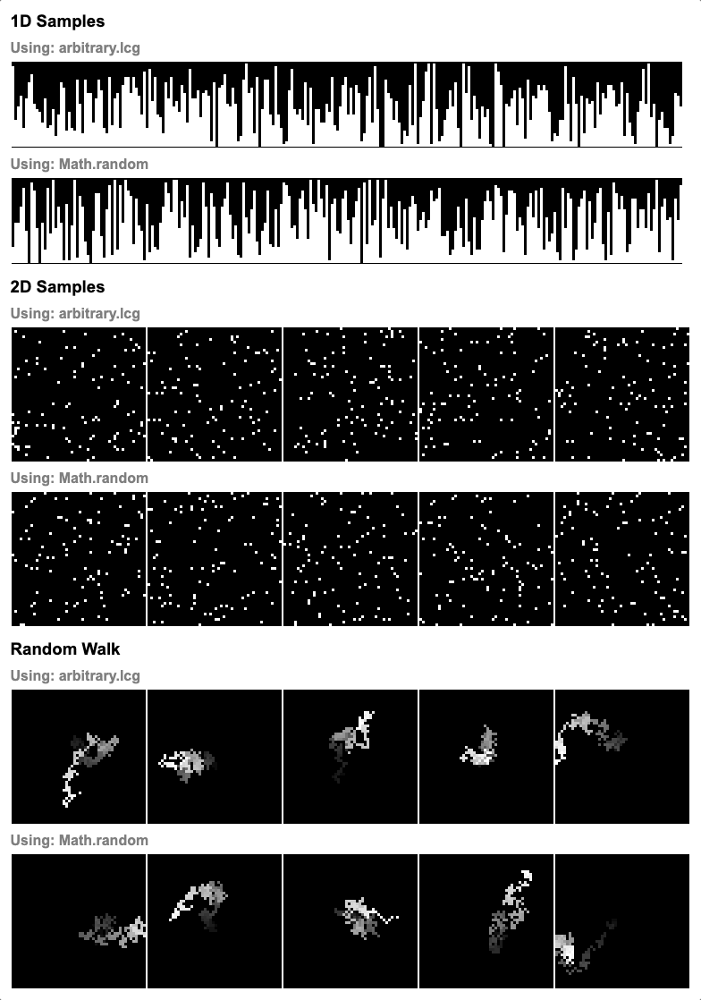

# Overview

A forward and backwards deterministic random number generator.

I started this project to explore simulations that can be run forwards and backwards, but I never ended up building anything sophisticated. To really explore this idea more constructs to easily design/compose programs that run in both directions would be required. Examples: loops, conditionals, and functions would need to run in both directions without having to write a forward and backwards version by hand.

Irregardless, it's still useful for generative art and random behavior in games.

See Demos:

- [Bidirectional Determinism (Random Walk)](https://seflless.github.io/arbitrary/examples/bidirectional-determinism.html)
- [Tests](https://seflless.github.io/arbitrary/examples/tests.html)

## Features

- Is deterministic (provide the same seed to get same stream of random values)
- Is reversible (see [next/prev](#reversing) section)
- Internal state only takes up 32bits
- Has a period length of 2^32
- Each value from [0, 2^32) is generated exactly once in the total period
- Has great test coverage

## Screenshots



# Installation

```
npm install arbitrary
```

# Usage

## Basics

```js
import arbitrary from "arbitrary";

// Creates a Generator with a random seed.
let generate = new arbitrary.Generator();

console.log(generate.next.number(-10, 10));
console.log(generate.next.percent());
console.log(generate.next.bits(1));
console.log(generate.next.bits(32));
```

## Deterministic

```js
import arbitrary from "arbitrary";
// Create a Generator with a seed
let deterministic = new arbitrary.Generator(42);

// Will always be: 0.2523451747838408
console.log(deterministic.next.percent());
// Will always be: 22
console.log(deterministic.next.bits(8));
// Will always be: 5772.811982315034
console.log(deterministic.next.number(0, 10000));
```

## Reversing

```js
import arbitrary from "arbitrary";

// Create a Generator with a seed
let generate = new arbitrary.Generator();

console.log(generate.next.number(0, 10000));
console.log(generate.next.number(-10, 10));
console.log(generate.next.percent());
console.log(generate.next.bits(1));
console.log(generate.next.bits(32));

// Now generate the reverse stream of the above numbers
console.log(generate.prev.bits(1));
console.log(generate.prev.percent());
console.log(generate.prev.number(-10, 10));
console.log(generate.prev.number(0, 10000));

/**
Output will be:

    0.734807450324297
    -3.3194907444994897
    0.9332054262049496
    1
    3735025540
    1
    0.9332054262049496
    -3.3194907444994897
    0.734807450324297
*/
```

## Scramble / Descramble

The scramble function is best used for turning sequences of ordered numbers (Ex. an increasing counter)
and scrambling the bits to get random number. It also reversible via `arbitrary.descramble()`.

A few obvious utilizing scrambling:

1.  Jump back and forward in a stream of randomly generated numbers.

- To do this, keep an index into a sequence and scramble the index you want a random number. Just
  jump or set the index to another point and scramble it again to recoup the random number generated
  at that point in time.
- For comparison using `Generator .next/.prev` can be forwarded/reversed, but
  it can only do so a single step at a time, making large jumps in a sequence
  take proportionally more CPU per distance jumped.

2.  Use scramble to take a `Generate` state and jump to another point in the sequence it generates.

- This is useful for instance when creating generative art and wanting to fork a
  new stream of random values.

**Important**: Use Generator .next/.prev if
you don't need this focus but just want a series of random numbers as `scramble`/`unscramble` are computationally
more expensive.

```js
import arbitrary from "arbitrary";

// Scramble the bits of an unsigned 32 bit integer
const scrambled42 = arbitrary.scramble(42);
// Should print '1077848774'
console.log(scrambled42);

// Reverse the scrambling to get back the original number
const unscrambled42 = arbitrary.descramble(scrambled42);
// Should print '42'
console.log(unscrambled42);
```

## API Reference

Coming soon. See examples above.

## Contributing

#### Setup

```
git clone git@github.com:francoislaberge/arbitrary.git
cd arbitrary
```

#### Watching

```
npm run watch
```

#### Building

```
npm run build
```

#### Publishing to NPM

Do the usual npm version bump then publish.

```
npm version <major|minor|patch>
git push; git push --tags
npm publish
```

#### Test

The tests must be built before they can be run. So use either the build or watch approach below before running the tests.

All tests are run automatically on push via [our travis-ci integration](https://travis-ci.org/francoislaberge/arbitrary)

```
npm run test
```

#### Watch Tests

Automatically builds tests when any source code changes (test or regular).

```
npm run watch-test
```

#### Build Tests

```
npm run build-test
```
